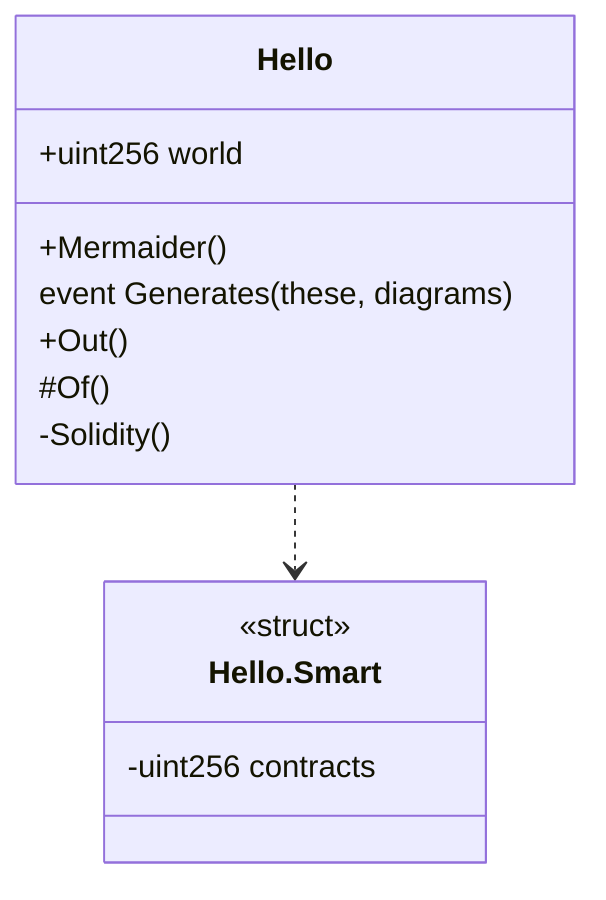

# Mermaider

Mermaider is a Python tool that generates
[class diagrams](https://mermaid.js.org/syntax/classDiagram.html)
for smart contracts written in [Solidity](https://soliditylang.org/).


### Example

```solidity
contract Hello {
    uint256 public world;
    function Mermaider() public {}
    event Generates(uint256 these, uint256 diagrams);
    function Out() external {}
    function Of() internal {}
    function Solidity() private {}
    struct Smart {
        uint256 contracts;
    }
}
```

is turned into



For a more complex example, check [UniswapV3Pool](./examples/UniswapV3Pool.mermaid).


### Usage

- This project has no external Python dependencies.
- Expected input is `solc` ^0.8 ASTs.

```
solc                                                                 \
  /home/someone/path/to/my/Contract.sol                              \
  @openzeppelin=/home/someone/path/to/my/node_modules/\@openzeppelin \
  --combined-json ast >/tmp/artifacts.json

git clone git@github.com:ydm/mermaider.git
cd mermaider
python main.py </tmp/artifacts.json
```


### Optional dependencies

If `eth-hash` is installed, function signatures (as displayed in the
diagram) will be additionally hashed and checked against the compiled
function selectors.

```
python -m venv env
source env/bin/activate
python -m pip install --upgrade pip
python -m pip install eth-hash[pycryptodome]
python main.py
```


### TODOs
- `+struct Oracle.Observation[65535] observations` ...
- Integrate [solc-select](https://pypi.org/project/solc-select/)?

